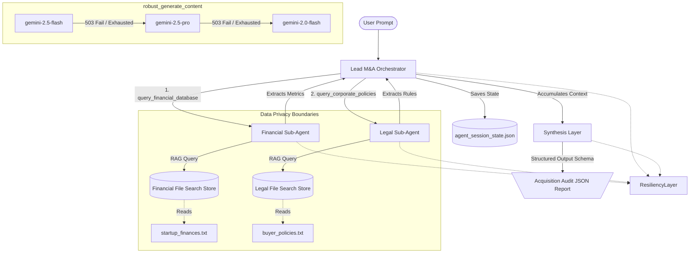

# Stateful Multi-Agent M&A Compliance RAG Orchestrator

An enterprise-grade, stateful Multi-Agent Retrieval-Augmented Generation (RAG) system built using the modern `google-genai` Python SDK. The system orchestrates specialized sub-agents to perform a compliance audit on a target company (M&A scenario), comparing financial health metrics against corporate limits.

## 📐 System Architecture (Mermaid Diagram)



---

## 🚀 Key Engineering Features

### 1. Isolated Vector Search boundaries (Data Privacy)
Rather than index all company data into a single vector database, this system provisions **decoupled File Search Stores** for different business domains:
* **Financial Index:** Contains target balance sheets and Net Burn Rate.
* **Legal Index:** Contains corporate buying restrictions.
Sub-agents are strictly isolated to their respective stores to ensure data privacy boundaries and avoid cross-contamination.

### 2. Resilient API Failover (Adaptive Fallback Matrix)
To survive severe server-side `503 UNAVAILABLE` capacity spikes or rate limits, the system routes all generation requests through a custom-built failover matrix:
* Attempts generation using high-performance models (`gemini-2.5-flash`).
* Automatically triggers **exponential backoff retries** on network drops.
* If a model is exhausted, it **dynamically falls back** to the next available tier (`gemini-2.5-pro`, `gemini-2.0-flash`, etc.) mid-flight to prevent execution failure.

### 3. Stateful Loop Persistence & Base64 Serialization
The orchestration loop supports pausing and resuming.
* Serializes conversational history to a local JSON state snapshot.
* Addresses Pydantic schema constraints by base64-encoding model-generated binary payloads (like `thought_signature`) before serialization, reconstructing them seamlessly on subsequent turns.
* Injecting explicit error strings inside the sub-agent tool state ensures that the Orchestrator stops requesting empty tools if RAG context timeout occurs, preventing infinite loops.

### 4. Strict Pydantic Output Contracts
The final synthesis agent is strictly constrained to compile the audit findings into a structured Pydantic object (`AcquisitionAuditReport`), ensuring the resulting JSON is 100% type-safe, validated, and ready for downstream microservices.

---

## 🛠️ Tech Stack
* **Language:** Python 3.12.9
* **SDK:** `google-genai` (Modern Gemini Developer API)
* **Libraries:** `pydantic` (for type enforcement and contract matching)
* **Storage:** Google GenAI File Search Stores (Vector Database)

---

## 💻 Setup & Run

1. Clone the repository and configure the virtual environment:
   ```bash
   python -m venv venv
   source venv/bin/activate
   pip install google-genai pydantic
   ```

2. Add your Gemini API key to a `.env` file in the project root:
   ```env
   GEMINI_API_KEY=your_gemini_api_key_here
   ```

3. Run the orchestration pipeline:
   ```bash
   python manual_sandbox.py
   ```
